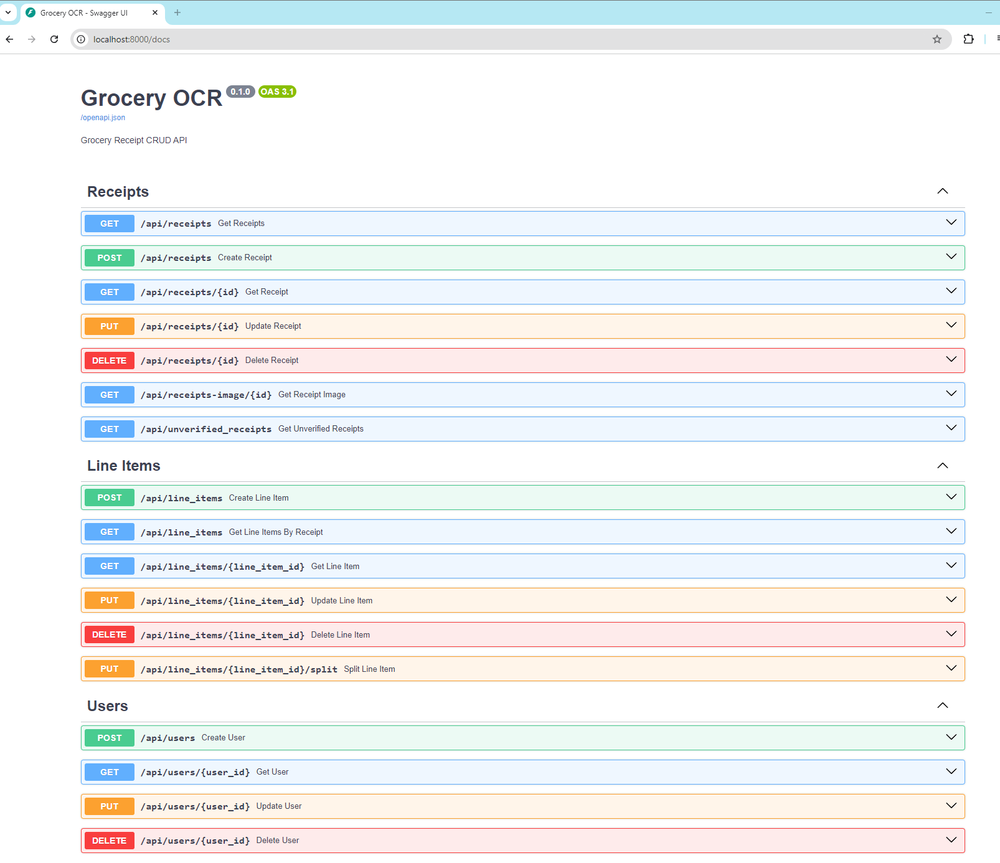
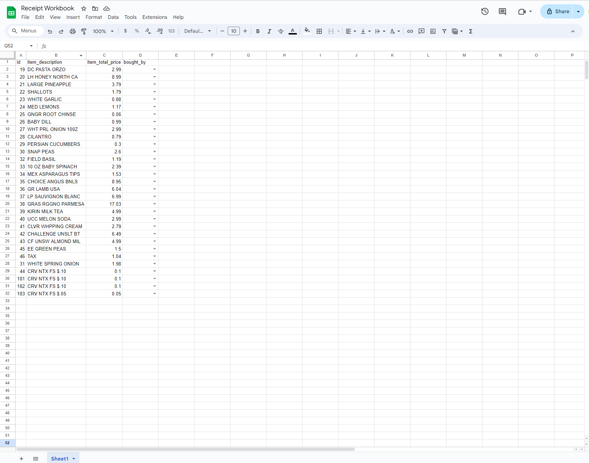

# Grocery Receipt OCR API

## Technology Stack and Features

- ⚡ [**FastAPI**](https://fastapi.tiangolo.com) for the Python backend API.
    - 🧰 [SQLAlchemy](https://www.sqlalchemy.org/) for the Python SQL database interactions (ORM).
    - 🔍 [Pydantic](https://docs.pydantic.dev), used by FastAPI, for the data validation and settings management.
    - 💾 [PostgreSQL](https://www.postgresql.org) as the SQL database.
    - 📊 [GoogleSheetsAPI](https://developers.google.com/sheets) for easy database interaction.
- 🐋 [Docker Compose](https://www.docker.com) for development and production.
- ✅ Tests with [Pytest](https://pytest.org).

### Interactive API Documentation

[](https://github.com/bho597/Grocery-OCR/tree/main)

### GoogleSheets Integration

[](https://github.com/bho597/Grocery-OCR/tree/main)

## How To Use It

You can **just fork or clone** this repository.

### Update From the Original Repo

After cloning the repository, and after doing changes, you might want to get the latest changes from this original template.

- Make sure you added the original repository as a remote, you can check it with:

```bash
git remote -v

origin    git@github.com:user/my-grocery-ocr.git (fetch)
origin    git@github.com:user/my-grocery-ocr.git (push)
upstream    git@github.com:bho597/Grocery-OCR.git (fetch)
upstream    git@github.com:bho597/Grocery-OCR.git (push)
```

- Pull the latest changes without merging:

```bash
git pull --no-commit upstream master
```

This will download the latest changes from this template without committing them, that way you can check everything is right before committing.

- If there are conflicts, solve them in your editor.

- Once you are done, commit the changes:

```bash
git merge --continue
```

### Configure

You can then update configs in the `.env` files to customize your configurations. Some environment variables in the `.env` file have a default value of `changethis`. Modify these values for your specific implementation.

The following environment variables need to be in the `.env` file:

- `azure_container_account_name`
- `azure_container_container_name`
- `azure_container_account_key`

- `azure_document_intelligence_endpoint`
- `azure_document_intelligence_key`

- `postgresql_url`

- `google_sheets_scopes`
- `google_sheets_spreadsheet_id`
- `google_sheets_sheet_name`


## Deployment
The following tools are used to support this API. Below outlines how to set up each tool:

### Azure Container
This will be where the receipt images be stored for future use. Further documentation on how to create and setup a container instance can be found [here](https://azure.microsoft.com/en-us/products/container-instances).

Once created, you will need the following:
- `Account Name`: The name of the Azure account name.
- `Container Mame`: The name of the Azure container name.
- `Account Key`: The account key to provide read and write access to the API.

### Azure Document Intelligence
This is the main workhorse for the OCR side of the application. Further documentation on how to use Azure Document Intelligence can be found [here](https://azure.microsoft.com/en-us/products/ai-services/ai-document-intelligence).

Once created, you will need the following:
- `Endpoint` (default: `"https://westus3.api.cognitive.microsoft.com/"`): Endpoint to reach the Docuemnt Intelligence API. May need to adjust depending on region.
- `Key`: Access key to allow permissions to connect to Document Intelligence API.

### PostgreSQL
We will use PostgreSQL to store Receipt and User information. We will be using SQLAlchemy to communicate between FastAPI and the database.

Once setup, you will need the following:
- `PostgreSQL URL`: The URL connection string to connect to created PostgreSQL database instance. The URL will be in format "postgresql://[username]:[password]@[host_name]:[port_number]/[database_name]".

### GoogleSheets API
This allows for an easy front-end integration with a familiar UI. Further information on setup and use can be found [here](https://developers.google.com/sheets).

Once created, you will need the following:
- `Scopes` (default: `https://www.googleapis.com/auth/spreadsheets`): Endpoint of API to connect to. Should not need to modify.
- `Spreadsheet ID`: Spreadsheet ID of the sheet to use as workbook. This can be found in the google sheet link (e.g. https://docs.google.com/spreadsheets/d/[spreadsheet_id]/edit?gid=0#gid=0).
- `Sheet Name` (default: `Sheet1`: Name of Sheet Name in providided Google Sheet.

### Kubernetes
You will need to generate your own Kubernetes Secrets files as the current Secrets files in the repo are sealed. Secrets values are encoded but not encrypted and therefore, should not be stored inside this repo as is. To find out more on sealing secrets, you can access the documentation on [Sealed Secrets here](https://github.com/bitnami-labs/sealed-secrets).

Provided are 2 template Secrets files in the `api/infra` directory that has values of `changethis` for secrets values that should be adjusted.

## License

The Grocery OCR API is licensed under the terms of the MIT license.
